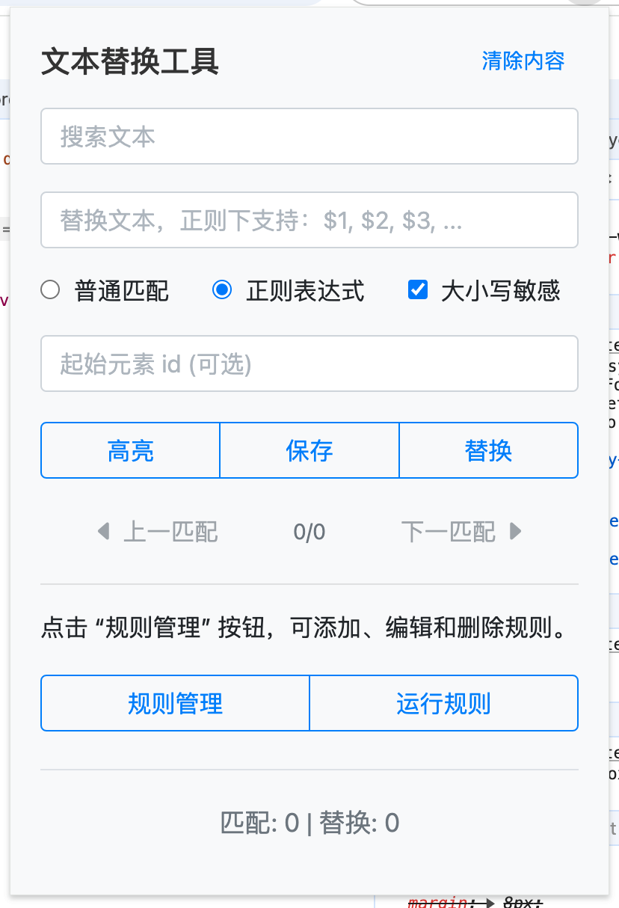

[中文 README](README_CN.md)

# Chrome Extension: Find and Replace

This Chrome extension allows you to search for and replace text within the active tab's content. It supports both normal and regular expression searches, case-sensitive options, and provides a user-friendly popup interface for easy access.

## Features

-   Support search for text using normal matching or regular expressions.
-   Highlight search results with navigation between matches.
-   Replace text within web page content.
-   Option to specify a starting element ID for targeted searches.
-   Case-sensitive search option.
-   Persistent storage of search settings.
-   Process content within iframes (where accessible).

## Installation

1. Clone the repository:

    ```
    git clone https://github.com/shengyanli1982/find-and-replace-chrome-extension.git
    ```

2. Open Chrome (or any Chromium-based browser) and navigate to `chrome://extensions/`.
3. Enable "Developer mode" in the top right corner.
4. Click "Load unpacked."
5. Select the `find-and-replace-extension` directory.
6. The extension should now be installed and ready to use.

## Usage

Interface preview:



1. Click the extension icon in the Chrome toolbar to open the popup.
2. Enter your search text and (optionally) replacement text.
3. Choose between normal matching or regular expression.
4. Toggle case sensitivity if needed.
5. Optionally, specify a starting element ID to narrow the search scope.
6. Click "Highlight" to highlight all occurrences of the search text.
7. Use the navigation buttons to move between matches.
8. Click "Replace" to replace all occurrences of the search text with the specified replacement.
9. Click "Clear Content" to reset all fields and remove highlights.

You can view the extension's process in the browser's console.


## Notes

-   The extension will only work on the current active tab.
-   The extension may not work on all websites due to browser security policies.
-   Content within iframes will be processed if accessible.

## Development

### 1. Popup Interface

The popup interface is defined in `popup/popup.html` and styled using Bootstrap and custom CSS in `popup.css`. It includes input fields for search and replace text, options for match type and case sensitivity, and buttons to trigger highlight, replace, and navigation actions.

### 2. JavaScript Functionality

The main JavaScript logic is implemented in `popup/popup.js` and `scripts/content.js`.

#### `popup/popup.js`

-   Initializes event listeners for all buttons and handles user interactions.
-   Manages the state of the popup interface, including navigation buttons and statistics.
-   Handles storage and retrieval of user settings using either `chrome.storage.local` or `localStorage`.
-   Sends messages to the active tab to perform highlight, replace, and navigation actions.

#### `scripts/content.js`

-   Listens for messages from the popup and performs the corresponding actions (highlight, replace, remove highlights, navigate).
-   Implements text searching, highlighting, and replacing functionality.
-   Handles navigation between highlighted matches.
-   Processes content within accessible iframes.

### 3. Storage

The extension uses `chrome.storage.local` if available, otherwise falls back to `localStorage` for persisting user settings across sessions.

## Contributing

1. Fork the repository.
2. Create a new branch (`git checkout -b feature-branch`).
3. Make your changes.
4. Commit your changes (`git commit -am 'Add new feature'`).
5. Push to the branch (`git push origin feature-branch`).
6. Create a new Pull Request.

## License

This project is licensed under the MIT License. See the [LICENSE](LICENSE) file for details.
