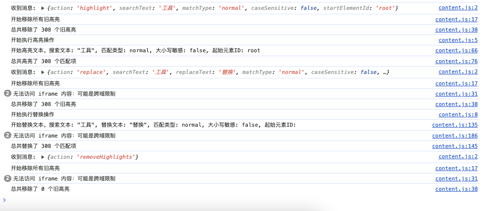

[English README](README.md)

# Chrome 扩展：查找与替换

这个 Chrome 扩展允许您在当前活动标签页的内容中搜索和替换文本。它支持普通匹配和正则表达式搜索，提供大小写敏感选项，并提供用户友好的弹出界面，方便使用。

## 功能特性

-   支持使用普通匹配或正则表达式进行文本搜索。
-   高亮显示搜索结果，并可在匹配项之间导航。
-   替换网页内容中的文本。
-   可选择指定起始元素 ID 进行目标搜索。
-   大小写敏感搜索选项。
-   搜索设置的持久化存储。
-   处理可访问的 iframe 内容。

## 安装

1. 克隆仓库：

    ```
    git clone https://github.com/shengyanli1982/find-and-replace-chrome-extension.git
    ```

2. 打开 Chrome（或任何基于 Chromium 的浏览器）并导航至 `chrome://extensions/`。
3. 在右上角启用"开发者模式"。
4. 点击"加载已解压的扩展程序"。
5. 选择 `find-and-replace-extension` 目录。
6. 扩展程序现在应该已安装完成，可以使用了。

## 使用方法

界面预览：


1. 点击 Chrome 工具栏中的扩展图标打开弹出窗口。
2. 输入搜索文本和（可选的）替换文本。
3. 选择普通匹配或正则表达式。
4. 根据需要切换大小写敏感选项。
5. 可选择指定起始元素 ID 以缩小搜索范围。
6. 点击"高亮"以高亮显示搜索文本的所有匹配项。
7. 使用导航按钮在匹配项之间移动。
8. 点击"替换"以将搜索文本的所有匹配项替换为指定的替换文本。
9. 点击"清除内容"以重置所有字段并移除高亮。

您可以在浏览器的控制台中查看扩展程序的处理过程。



## 注意事项

-   扩展程序仅在当前活动标签页中生效。
-   由于浏览器安全策略，扩展程序可能无法在所有网站上运行。
-   如果可访问，将处理 iframe 内的内容。

## 开发

### 1. 弹出界面

弹出界面在 `popup/popup.html` 中定义，使用 Bootstrap 和 `popup.css` 中的自定义 CSS 进行样式设置。它包括搜索和替换文本的输入字段、匹配类型和大小写敏感选项，以及触发高亮、替换和导航操作的按钮。

### 2. JavaScript 功能

主要的 JavaScript 逻辑在 `popup/popup.js` 和 `scripts/content.js` 中实现。

#### `popup/popup.js`

-   为所有按钮初始化事件监听器并处理用户交互 ��
-   管理弹出界面的状态，包括导航按钮和统计信息。
-   使用 `chrome.storage.local` 或 `localStorage` 处理用户设置的存储和检索。
-   向活动标签页发送消息以执行高亮、替换和导航操作。

#### `scripts/content.js`

-   监听来自弹出窗口的消息，并执行相应的操作（高亮、替换、移除高亮、导航）。
-   实现文本搜索、高亮和替换功能。
-   处理高亮匹配项之间的导航。
-   处理可访问的 iframe 内容。

### 3. 存储

扩展程序优先使用 `chrome.storage.local`，如果不可用则回退到 `localStorage`，用于在会话之间持久化用户设置。

## 贡献

1. Fork 仓库。
2. 创建新分支（`git checkout -b feature-branch`）。
3. 进行修改。
4. 提交更改（`git commit -am '添加新功能'`）。
5. 推送到分支（`git push origin feature-branch`）。
6. 创建新的 Pull Request。

## 许可证

本项目采用 MIT 许可证。详情请参阅 [LICENSE](LICENSE) 文件。
